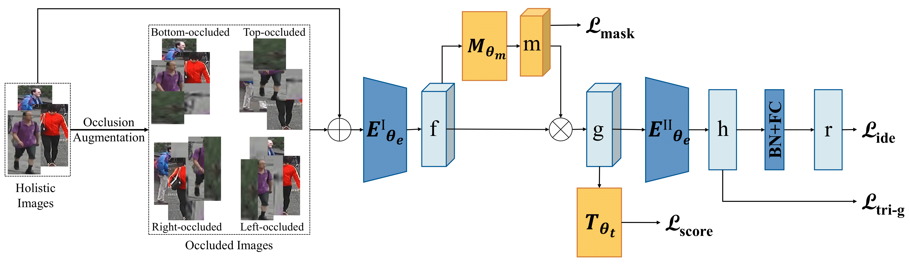

# Occlude Them All: Occlusion-Aware Attention Network for Occluded Person Re-ID

This resposity is the official implementation of our ICCV2021 [Paper](https://openaccess.thecvf.com/content/ICCV2021/html/Chen_Occlude_Them_All_Occlusion-Aware_Attention_Network_for_Occluded_Person_Re-ID_ICCV_2021_paper.html). 


### Dependent
* python 3.7.5
* pytorch 1.3.1

### Usage
* train the occludedduke
```
    bash train_occludedduke.sh
```

* train the partial datasets
```
    bash train_partial.sh
```

### Citations
If our paper helps your research, please cite it in your publications:
```
@inproceedings{chen2021occlude,
  title={Occlude them all: Occlusion-aware attention network for occluded person re-id},
  author={Chen, Peixian and Liu, Wenfeng and Dai, Pingyang and Liu, Jianzhuang and Ye, Qixiang and Xu, Mingliang and Chen, Qi’an and Ji, Rongrong},
  booktitle={Proceedings of the IEEE/CVF International Conference on Computer Vision},
  pages={11833--11842},
  year={2021}
}
```
